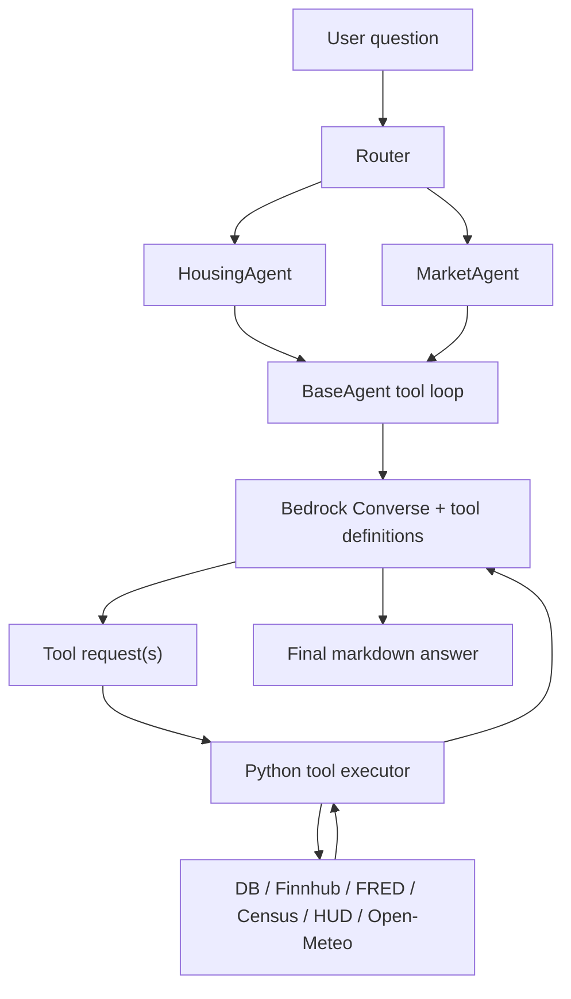

# Virtual Economist Agent Architecture

This repo now uses real Bedrock tool-use agents instead of the old fixed prompt
pipeline.

## Current runtime

- FastAPI app: `backend/app/main.py`
- Unified chat route: `POST /api/chat`
- Direct routes: `POST /api/chat/housing`, `POST /api/chat/market`
- Agent base loop: `backend/app/agents/base.py`
- Housing agent: `backend/app/agents/housing/agent.py`
- Market agent: `backend/app/agents/market/agent.py`
- Bedrock wrapper: `backend/app/services/bedrock.py`
- Live data clients: `backend/app/services/live_apis.py`
- Stock snapshot sync: `backend/app/services/stock_sync.py`

## Tool-use flow



The loop is:

1. User question is sent to Bedrock with tool definitions.
2. Nova Pro decides whether to answer directly or call one or more tools.
3. Python executes the requested tools.
4. Tool results are sent back to Bedrock.
5. Bedrock answers from the gathered evidence.

`tool_trace` is returned in the API response for debugging.

If a question is outside the product scope, the unified router returns a short
"this app is for housing/city and stock/market questions" response instead of
forcing it into one of the two agents. The direct housing/market endpoints are
also prompted to decline unrelated questions.

## Agents

### Housing agent

Tools:

- `search_housing_inventory`
  Source: `housing_time_series`
  Use for inventory trend questions.
- `get_city_demographics`
  Source: Census ACS
  Returns median home value, median gross rent, median household income.
- `get_fair_market_rent`
  Source: HUD
  Returns FMR by bedroom size.
- `get_city_weather`
  Source: Open-Meteo
  Returns current weather plus a short forecast.
- `get_economic_indicators`
  Source: FRED
  Supports `mortgage_rate`, `unemployment_rate`, `fed_funds_rate`, `inflation_cpi`, `gdp`.

Notes:

- Inventory is DB-backed.
- Demographics/rent/macro/weather are live API backed.
- Open-Meteo does not require a separate API key.

### Market agent

Tools:

- `search_ticker`
  Source: Finnhub search
- `get_stock_quote`
  Source: Finnhub quote
- `get_company_profile`
  Source: Finnhub profile
- `get_analyst_recommendations`
  Source: Finnhub recommendation endpoint
- `get_economic_indicators`
  Source: FRED
  Supports `unemployment_rate`, `fed_funds_rate`, `inflation_cpi`, `gdp`, `mortgage_rate`.
- `screen_companies`
  Source: `stock_data`
  Use for sector / analyst / ownership screens.

Notes:

- Live quote/profile/analyst tools are for company-specific questions.
- `screen_companies` uses the local `stock_data` snapshot, which should be refreshed from live APIs.
- Finnhub quote data includes intraday high/low, not 52-week highs/lows.

## `stock_data` requirements

`stock_data` should hold one JSONB snapshot row per ticker. The current sync writes:

```json
{
  "ticker": "AAPL",
  "name": "Apple Inc",
  "sector": "Technology",
  "industry": "Technology",
  "recommendation": "Buy",
  "recommendation_period": "2026-03-01",
  "strong_buy_count": 14,
  "buy_count": 22,
  "hold_count": 16,
  "sell_count": 2,
  "strong_sell_count": 0,
  "exchange": "NASDAQ",
  "country": "US",
  "market_cap_B": 3821.35,
  "insider_ownership": null,
  "institutional_ownership": null,
  "ownership_data_status": "unavailable_on_current_finnhub_plan",
  "source": "finnhub"
}
```

Minimum fields for useful screening:

- `ticker`
- `name`
- `sector`
- `industry`
- `recommendation`
- `strong_buy_count`
- `buy_count`
- `hold_count`
- `sell_count`
- `strong_sell_count`

Optional but useful:

- `exchange`
- `country`
- `market_cap_B`
- `insider_ownership`
- `institutional_ownership`
- `recommendation_period`

## How to run

### 1. Backend API

From repo root:

```bash
uv --project backend sync
uv --project backend run uvicorn backend.app.main:app --reload --port 8000
```

Backend docs:

- Swagger: `http://localhost:8000/docs`
- ReDoc: `http://localhost:8000/redoc`

### 2. Frontend

```bash
cd frontend
npm install
npm start
```

Frontend dev server runs on `http://localhost:3000`.

### 3. Legacy Node auth server

This repo also contains an older Express auth server:

```bash
cd backend
npm install
npm start
```

That server runs on port `800` from `backend/app/index.js`. The current agent
API is the FastAPI app on port `8000`.

## Environment variables

Set these in `backend/.env`:

- `FINNHUB_API_KEY`
- `FRED_API_KEY`
- `CENSUS_API_KEY`
- `HUD_API_TOKEN`
- `AWS_REGION`
- `DB_HOST`
- `DB_PORT`
- `DB_NAME`
- `DB_USER`
- `DB_PASSWORD`
- `JWT_SECRET`
- `CORS_ORIGINS`

`live_apis.py` now loads `backend/.env` directly as a fallback, so scripts and
direct module imports still see the API keys.

## Refreshing `stock_data`

Populate or refresh the stock snapshot table:

```bash
uv --project backend run python -m backend.scripts.sync_stock_data --truncate
```

Starter universe is defined in `backend/app/services/stock_sync.py`.

Useful flags:

- `--tickers AAPL,MSFT,NVDA`
- `--truncate`
- `--with-embeddings`
- `--delay-seconds 0.6`

## Example requests

### Unified routing

```bash
curl -X POST http://localhost:8000/api/chat \
  -H "Content-Type: application/json" \
  -d '{"question":"What is Apple current stock price?"}'
```

```bash
curl -X POST http://localhost:8000/api/chat \
  -H "Content-Type: application/json" \
  -d '{"question":"Compare median home values in Philadelphia, Austin, and Miami."}'
```

```bash
curl -X POST http://localhost:8000/api/chat \
  -H "Content-Type: application/json" \
  -d '{"question":"What is the weather forecast in Austin, Texas this week?"}'
```

### Direct housing

```bash
curl -X POST http://localhost:8000/api/chat/housing \
  -H "Content-Type: application/json" \
  -d '{"question":"What is the housing inventory in Austin, Texas?"}'
```

### Direct market

```bash
curl -X POST http://localhost:8000/api/chat/market \
  -H "Content-Type: application/json" \
  -d '{"question":"Which technology companies have strong buy ratings?"}'
```

## Response shape

```json
{
  "answer": "...",
  "agent_type": "market",
  "conversation_id": null,
  "rows_found": 6,
  "sql_used": "SELECT ...",
  "error": null,
  "tool_trace": [
    {
      "tool": "screen_companies",
      "status": "success",
      "input": {
        "sector": "Technology",
        "analyst_signal": "strong_buy"
      },
      "output_preview": {
        "row_count": 6
      }
    }
  ]
}
```

## Adding a new tool

1. Add the tool definition to `_get_tools()` in the agent.
2. Implement the executor in `_execute_tool()`.
3. Keep outputs JSON-serializable.
4. If the tool queries SQL, use `BaseAgent._safe_execute()` and parameterized inputs.
5. Add a test under `backend/tests`.

## Verification

Backend checks:

```bash
uv --project backend run ruff check backend
uv --project backend run pytest backend/tests
```

Quick smoke tests:

- Apple quote
- macro indicator question
- housing inventory question
- housing weather question
- multi-city housing comparison
- broad stock screener question
